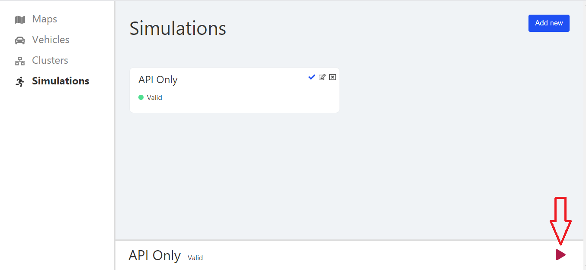
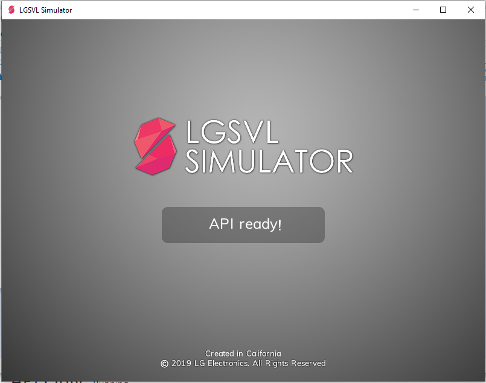

## Simülasyonu çalıştırma

### LGSLV simülasyonu indirme linki

https://github.com/lgsvl/simulator/releases/download/2020.01/lgsvlsimulator-windows64-2020.01.zip

#### Simülasyonu nasıl çalıştırabilirim?
İndirdiğiniz zip dosyasını çıkardığınızda içerisindeki dosyada "simulator.exe" programını başlatarak simulasyonu çalıştırın.
Çıkan ekranda "Open Browser..." butonuna basın.

Açılan pencerede "Maps" kısmında Add'e tıklayarak Haritalar klasöründe bulunan "environment_DenemeMap" ı ekleyin.
"Vehicles" kısmında bulunan "Jaguar2015XE (No Bridge)" aracını indirin.

"Simulations" kısmında bulunan "API Only" nin üzerine tıklayın ve sağ alttaki kırmızı oka basıp çalıştırın.

LGSLV Simülasyonununda "API Ready" yazısını gördükten sonra

Projenin "server" klasöründe bulunan "map_test.py" dosyasını çalıştırın. 
Bunu yapmadan önce server klasöründe bulunan Readme.MD dosyasındaki işlemleri gerçekleştirin.

"map_test.py" dosyasını açtığınız terminalde "Enter" tuşuna bastığınızda oluşan aracın 2 saniye boyunca ileri gittiğini göreceksiniz.

### Yapılacaklar
- [ ] Kendi simülasyon haritamız oluşturulacak
  - [ ] Trafik lambası modellenecek
  - [ ] Trafik işaretleri modellenecek
  - [ ] Harita modellenecek
- [ ] Python API ı ile aracımızın kontrolü sağlanacak.